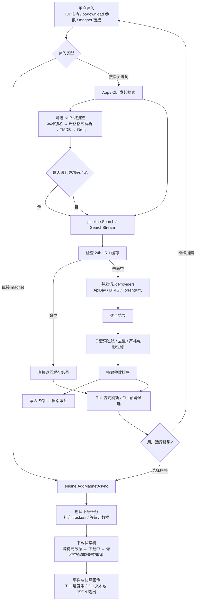

# bt-spider

磁力搜索 + BT 下载工具。聚合 4 个搜索源，结果流式推送、按做种数排序；支持**交互式 TUI** 与**无头命令行**两种使用方式。

## 功能

- 聚合 3 个搜索源：ApiBay（ThePirateBay）、BT4G、TorrentKitty，并发请求
- **流式搜索**：每个 provider 返回即刷新 TUI，不等待最慢的源
- **24h 内存搜索缓存**（LRU，最多 256 条）：同一关键词重复搜索瞬时返回
- **NLP 电影识别**：中英文别名 → 严格格式解析 → TMDB API（含 7 天响应缓存）→ Groq LLM 兜底
- 启动时异步预热常用 provider 域名的 TLS/DNS 连接，降低首次搜索冷启动延迟
- 全局共享 HTTP Transport，所有 provider 复用连接池（HTTP/2 + keep-alive）
- 搜索专用客户端：0 重试 + 2 次失败即触发熔断，单源异常不拖慢整体
- 磁力链接内置 17 个 tracker，提升元数据获取和连接成功率
- 自动拉取 tracker 列表（每 24h 刷新）
- 种子大小按需补全（DHT 元数据拉取，仅在下载时触发）
- 搜索审计数据库（SQLite，异步写入）：记录每次搜索会话、各 provider 结果及条目明细
- 结构化日志（JSON 格式，写入 `~/Library/Logs/BT-Spider/`）
- 支持分享率 / 保种时长自动停止做种
- 代理支持（`HTTP_PROXY` / `HTTPS_PROXY` 环境变量）

## 流程图



## 快速开始

### 编译

```bash
# TUI 主程序
go build -o bt-spider .

# 无头下载器（脚本 / AI 调用）
go build -o bt-download ./cmd/download
```

### TUI 模式

```bash
HTTPS_PROXY=http://127.0.0.1:7890 ./bt-spider
```

启动后进入全屏界面，上半部分显示搜索结果，下半部分显示下载任务进度条，每 500ms 自动刷新。

#### TUI 命令

| 输入 | 行为 |
|------|------|
| 任意文本 | 先用原词发起流式搜索（投机搜索），同时异步走 NLP 识别；若 NLP 结果与原词不同，自动切换到精确查询 |
| `search <关键词>` | 直接对关键词发起流式搜索，不经过 NLP |
| `movie <片名>` | 用本地别名库 + 严格格式解析器识别片名，成功后发起流式搜索 |
| `<序号>` | 下载搜索结果列表中对应的条目 |
| `magnet:?xt=...` | 直接添加磁力链接到下载队列 |
| `c <序号>` | 取消指定下载任务并从列表移除 |
| `clear` | 移除所有已完成 / 失败 / 取消的任务 |
| `q` / `quit` / `exit` | 退出 |
| Ctrl+C | 退出 |

**示例：**

```
bt> 星际穿越 2014 1080P
# → 投机搜索 "星际穿越 2014 1080P" + NLP 识别中...
# → NLP 解析为 Interstellar 2014，切换精确查询

bt> search The Bourne Supremacy 2004
# → 直接搜索，流式更新，ThePirateBay 返回后先显示，其余源陆续追加

bt> movie 美国队长第二部
# → 本地别名识别 → Captain America: The Winter Soldier 2014 1080P → 搜索

bt> 1
# → 下载搜索结果第 1 条

bt> c 1
# → 取消下载任务 #1
```

> TUI 需要真实终端（TTY）。通过管道、AI 助手子进程等非 TTY 环境调用请改用 `bt-download`。

### 无头下载器（bt-download）

适合脚本、CI 或 AI 助手通过子进程调用，进度以每行一条流式输出，支持 JSON 模式。

```bash
# 关键词搜索，自动选做种数最高的第 1 条
./bt-download "The Bourne Supremacy 2004"

# 指定选第 2 个结果
./bt-download --pick 2 "Ubuntu 24.04"

# 直接下载磁力链接
./bt-download 'magnet:?xt=urn:btih:90FD7709140B1C82C32E6014FB1F99A317DB68A3'

# JSON 流式输出 + 指定下载目录
./bt-download --json --dir /tmp/dl "Ubuntu 24.04"
```

**所有选项：**

```
--dir <path>       下载目录（默认使用 config.json 或 ~/Downloads/BT-Spider）
--pick <N>         搜索模式下选第 N 个结果（默认 1，按做种数排序）
--show <N>         搜索模式下预览前 N 条候选（默认 5）
--json             每行输出一条 JSON（默认文本格式）
--interval <dur>   进度输出间隔（默认 2s）
```

**文本输出样例：**

```
[search] keyword="The Bourne Supremacy 2004"
[result] [1] The Bourne Supremacy (2004) 1080p BrRip x264 YIFY | 1.51 GB | S:154 L:5 | ThePirateBay
[result] [2] The Bourne Supremacy 2004 1080p BluRay x265 | 3.91 GB | S:42 L:8 | ThePirateBay
[picked] name="The Bourne Supremacy (2004) 1080p BrRip x264 YIFY" dir=/Users/you/Downloads/BT-Spider
[meta]   等待元数据...  peers=7
[progress] 2.1%  32 MB/1.51 GB  ↓ 8.5 MB/s  peers=12  ETA 2m54s
[done]   ✅ The Bourne Supremacy (2004) 1080p BrRip x264 YIFY -> /Users/you/Downloads/BT-Spider
```

**JSON 输出样例（每行一条）：**

```json
{"event":"search","keyword":"Ubuntu 24.04","ts":"2026-04-17T10:22:01+08:00"}
{"event":"result","index":1,"name":"ubuntu-24.04-desktop-amd64.iso","size":"4.7 GB","seeders":523,"leechers":12,"source":"BT4G","ts":"..."}
{"event":"progress","percent":"63.2","completed":"3.0 GB","total":"4.7 GB","speed":"15.2 MB/s","peers":42,"eta":"1m52s","ts":"..."}
{"event":"done","name":"ubuntu-24.04-desktop-amd64.iso","dir":"/tmp/dl","ts":"..."}
```

**退出码：** `0` 成功 / `1` 失败 / `2` 参数错误 / `130` 用户中断（Ctrl+C）

## 搜索源

| 来源 | 类型 | 接口 | 默认启用 |
|------|------|------|---------|
| ApiBay（ThePirateBay） | 综合 | JSON API | ✅ |
| BT4G | 综合 | RSS | ✅ |
| TorrentKitty | 综合 | HTML 解析 | ✅ |
| 1337x | 综合 | HTML 解析 | ❌ 已禁用（详情页延迟高） |
| EZTV | 美剧 | JSON API | ❌ 未启用 |

## 配置

根目录 `config.json` 为可选配置文件，缺失时使用全部默认值。

```json
{
  "download_dir": "",
  "max_results": 100,
  "max_conns": 80,
  "listen_port": 0,
  "seed": false,
  "seed_ratio_limit": 1.0,
  "seed_time_limit": "30m",
  "enable_tracker_list": true,
  "tmdb_api_key": "",
  "groq_api_key": "",
  "log_dir": "",
  "log_level": "info",
  "search_db_path": ""
}
```

| 字段 | 默认值 | 说明 |
|------|--------|------|
| `download_dir` | `~/Downloads/BT-Spider` | 下载目录 |
| `max_results` | `100` | 单次搜索最大返回条数 |
| `max_conns` | `80` | 每个种子最大连接数 |
| `listen_port` | `0`（随机） | BT 监听端口，0 表示自动分配 |
| `seed` | `false` | 下载完成后是否继续做种 |
| `seed_ratio_limit` | `1.0` | 分享率达到此值时停止做种（`0` = 禁用） |
| `seed_time_limit` | `"30m"` | 保种时长上限（`"0s"` = 禁用） |
| `enable_tracker_list` | `true` | 是否自动拉取远端 tracker 列表 |
| `tmdb_api_key` | `""` | TMDB API Bearer Token（用于 NLP 电影识别） |
| `groq_api_key` | `""` | Groq API Key（NLP 识别的 LLM 兜底） |
| `log_dir` | `~/Library/Logs/BT-Spider/` | 日志目录 |
| `log_level` | `"info"` | 日志级别：`debug` / `info` / `warn` / `error` |
| `search_db_path` | `~/Library/Application Support/BT-Spider/search_history.db` | 搜索审计数据库路径 |

TUI 启动时可以用命令行参数覆盖下载目录：

```bash
./bt-spider /Volumes/External/Downloads
```

## NLP 电影识别

直接输入中英文片名时，TUI 会并行走以下识别链（无需加任何命令前缀）：

1. **本地别名库**：内置常见中英文别名映射，无网络延迟
2. **严格格式解析**：识别 `片名 年份 分辨率` 格式（如 `Inception 2010 1080P`）
3. **TMDB API**：查询标准片名及年份，结果缓存 7 天；请求超时 800ms
4. **Groq LLM**：前三步均失败时调用，作为最终兜底

识别成功后自动切换为精确查询，覆盖投机搜索的中间结果。

## 代理

```bash
export HTTPS_PROXY=http://127.0.0.1:7890
./bt-spider
# 或
./bt-download "关键词"
```

## 日志

- 格式：JSON，结构化字段
- 路径：`~/Library/Logs/BT-Spider/bt-spider-YYYY-MM-DD.log`
- 内容：HTTP 请求、搜索 provider 调用、下载状态机转换、错误详情

```bash
# 按关键词过滤
grep '"level":"error"' ~/Library/Logs/BT-Spider/bt-spider-$(date +%F).log | jq .
```

## 搜索审计数据库

每次搜索均异步写入 SQLite（WAL 模式，不阻塞搜索流程）。

**表结构：**

- `search_runs`：搜索会话（关键词、总耗时、结果数、状态）
- `provider_attempts`：每个 provider 的调用结果（耗时、结果数、错误信息）
- `provider_items`：每条搜索结果的完整字段（名称、大小、做种数、磁力、来源）

```bash
sqlite3 ~/Library/Application\ Support/BT-Spider/search_history.db \
  "SELECT keyword, final_result_count, finished_at FROM search_runs ORDER BY started_at DESC LIMIT 10"
```

## 项目结构

```
.
├── main.go                          # TUI 入口（bubbletea）
├── config.json                      # 可选配置文件
├── app/
│   ├── app.go                       # 业务编排层（TUI/CLI 共用）
│   └── stream.go                    # App.SearchStream 流式搜索转发
├── cmd/download/
│   └── main.go                      # bt-download 无头 CLI
├── config/
│   └── config.go                    # 配置加载，DefaultConfig
├── engine/
│   ├── engine.go                    # BT 引擎，任务注册表，事件 channel
│   ├── download.go                  # 异步下载状态机，EWMA 速度/ETA
│   ├── download_test.go             # 状态机单元测试
│   ├── event.go                     # 离散事件类型定义
│   ├── handle.go                    # TorrentHandle 接口
│   ├── resolve.go                   # DHT 按需补全种子大小
│   └── trackers.go                  # Tracker 列表自动更新
├── search/
│   ├── types.go                     # 公共类型：Result、Provider 接口、MovieResolution、BuildMagnet
│   ├── parse.go                     # 工具函数：IsCJK、ParseMovieTitleYear 等
│   ├── providers/
│   │   ├── registry.go              # DefaultProviders()（返回 3 个启用的源）
│   │   ├── apibay.go                # ApiBay（ThePirateBay）JSON API
│   │   ├── bt4g.go                  # BT4G RSS
│   │   ├── torrentkitty.go          # TorrentKitty HTML 解析
│   │   ├── leet337x.go              # 1337x（已禁用）
│   │   └── eztv.go                  # EZTV（未启用）
│   ├── query/
│   │   ├── resolver.go              # Resolver 接口与链式组合
│   │   ├── nlp_resolver.go          # NLP 预处理（中文数字、意图词清洗）
│   │   ├── nlp_resolver_test.go
│   │   ├── movie_resolver.go        # 本地别名库 + 严格格式解析
│   │   ├── tmdb.go                  # TMDB API + 7 天响应缓存
│   │   └── groq_resolver.go         # Groq LLM 兜底
│   └── pipeline/
│       ├── search.go                # Search / SearchWithTimeout，去重，关键词过滤
│       ├── stream.go                # SearchStream 流式 API
│       ├── cache.go                 # 24h LRU 搜索缓存（max 256 条）
│       ├── audit_store.go           # 搜索审计 SQLite（异步写入）
│       ├── strict_movie.go          # 严格电影结果过滤与评分
│       ├── scrape.go                # UDP Tracker 补全做种数
│       └── filter_test.go
├── tui/
│   ├── tui.go                       # bubbletea Model / Update / View
│   └── cmds.go                      # tea.Cmd 工厂（所有异步副作用）
└── pkg/
    ├── httputil/
    │   ├── transport.go             # 全局共享 Transport + 启动预热
    │   ├── client.go                # NewClient（基础 HTTP 客户端）
    │   ├── resilient.go             # ResilientClient / NewSearchClient
    │   └── resilient_test.go
    ├── logger/
    │   └── logger.go                # 结构化日志（JSON）
    └── utils/
        └── format.go                # FormatBytes、FormatDuration
```

## 许可证

MIT
